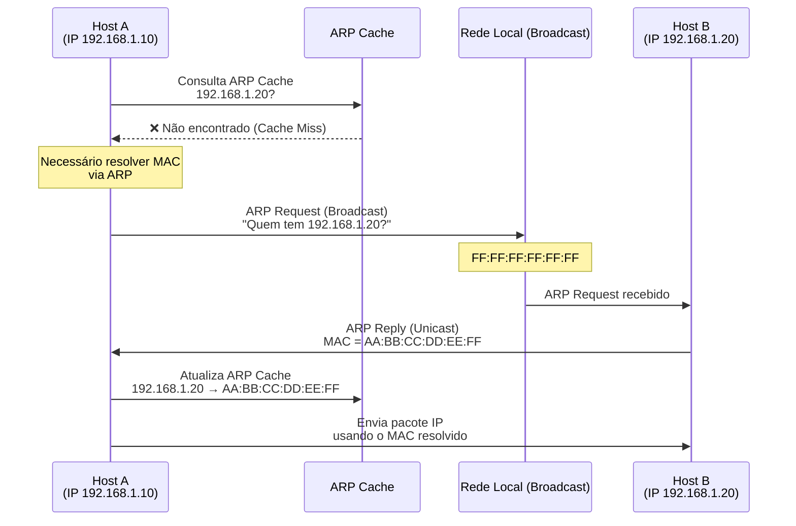

# System Design: Protocolos de Rede

## Introdução a Protocolos

> [!NOTE]
> Conjunto de regras que define formato e sequência de mensagens, garantindo interpretação correta entre diferentes sistemas, que assim define um padrão de comunicação.

## Introdução ao Modelo da Camada OSI (Open Systems Interconnection)

- Modelo Teórico (Open System Interconnection)
- Modelo de padronização/abstração que descreve como funcionam, onde estão, como são alocados e quais são as restrições dos determinados protocolos de rede.

### Camadas OSI

| Número camada | Camada       | O que engloba                        |
| ------------- | ------------ | ------------------------------------ |
| 7             | Aplicação    | HTTP, HTTPS, GTP, gRPC, Websockets   |
| 6             | Apresentação | SSL/TLS, MIME, JPEG, GIF             |
| 5             | Sessão       | RPC, SCP, SOCKS                      |
| 4             | Transporte   | TCP, UDP                             |
| 3             | Rede         | IPv4, IPv6                           |
| 2             | Enlace       | Point-to-Point Protocol, MAC Address |
| 1             | Física       | Cabeamento, Fibras, Wi-Fi            |

#### Camada 1: Física

- Componentes de Hardware
- Meios de Entrada e Saída de Rede
- Especificações:
  - Elétricas
  - Eletrônicas
  - Mecânicas
- Cabos de Rede, Fibra Óptica, Wi-Fi

#### Camada 2: Enlace

- Responsável pela transferencia de dados
- Correção direta entre dois nós (Point-to-Point)
- Endereços Físicos (MAC Address)

##### MAC Address

- Endereço físico dos Componentes
- Identificação única da placa de rede (NIC)
- Atribuído ao fabricante

#### Camada 3: Rede

- Controla a operação da sub-rede
- Endereçamento lógico (Através de IPv4 e IPv6)
- Protocolo ARP
- Associando endereço físico ao lógico

##### ARP (Address Resolution Protocol)

- Permite traduzir IP em endereços MAC em uma rede local
- Faz com que a camada 3 (Rede/IP) encontre a camada 2 (Enlace/MAC), mapeando endereços IP para endereços MAC
- Garante que os dados sejam enviados de forma correta na rede local

###### Funcionamento ARP



Posso rodar na minha maquina:

```bash
arp -a
```

Que mostra a tabela ARP dos dispositivos conectados na rede local.

#### Camada 4: Transporte

- Responsável pela transferência de dados fim-a-fim
- Implementa Protocolos de Transporte (TCP e UDP)
- Segmenta dados em pacotes
- Controle de Fluxo e Erros

##### TCP (Transmission Control Protocol)

- Conexão Orientada
- Garantia de Entrega
- Controle de Fluxo

##### UDP (User Datagram Protocol)

- Conexão Não Orientada
- Baixa Latência
- Sem Garantia de Entrega

#### Camada 5: Sessão

- Gerenciamento de Sessões
- Iniciar, Manter e Terminar conexões
- Controle de Diálogo
- Conexões Persistentes
- RPC (Remote Procedure Call)
- SCP (Secure Copy Protocol)
- SOCKS (Socket Secure)

#### Camada 6: Apresentação

- Traduz dados entre o formato da aplicação e o formato de rede
- Criptografia e Compressão
- Protocolos:
  - SSL/TLS (Secure Sockets Layer / Transport Layer Security)
  - MIME (Multipurpose Internet Mail Extensions)
  - GIF (Graphics Interchange Format)

#### Camada 7: Aplicação

- Interface entre o usuário e a rede
- Fornece serviços de rede diretamente aos aplicativos do usuário
- Camada mais próxima do usuário final
- Interface entre o software de aplicação e a rede
- Protocolos de Aplicação:
  - HTTP (Hypertext Transfer Protocol)
  - HTTPS (HTTP Secure)
  - GTP (GPRS Tunneling Protocol)
  - gRPC (Google Remote Procedure Call)
  - Websockets
